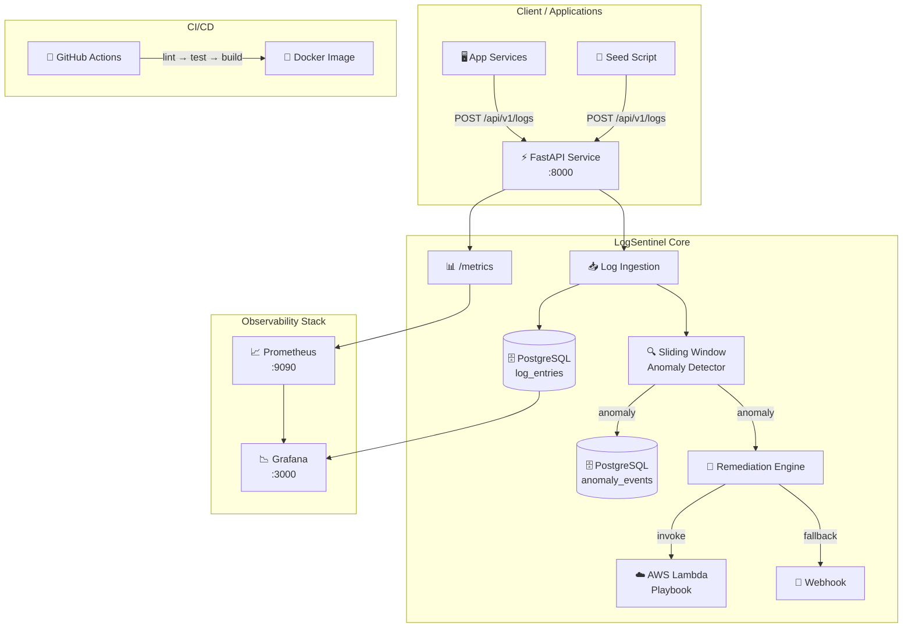

# 🛡️ LogSentinel

**Log Anomaly Detection & Auto-Remediation System**

A production-grade platform that ingests structured application logs, detects anomalies using configurable sliding window analysis, and triggers automated remediation playbooks — all with full observability via Prometheus + Grafana.

[](https://github.com/JaithraSarma/LogSentinel/actions/workflows/ci.yml)
[](https://www.python.org/downloads/)
[](LICENSE)

---

## Architecture



### Data Flow

1. **Ingest**: Applications POST structured JSON logs to `/api/v1/logs`
2. **Store**: Logs are persisted to PostgreSQL (`log_entries` table)
3. **Detect**: Each log entry is fed into a per-service sliding window detector
4. **Alert**: If error rate or p95 latency exceeds thresholds → anomaly event created
5. **Remediate**: Anomaly triggers the remediation engine (Lambda / mock / webhook)
6. **Observe**: Prometheus scrapes `/metrics`; Grafana renders live dashboard

---

## Tech Stack

| Component | Technology | Purpose |
|-----------|-----------|---------|
| API | FastAPI + Uvicorn | Async HTTP service |
| Database | PostgreSQL 16 | Log & anomaly storage |
| ORM | SQLAlchemy 2.0 (async) | Database abstraction |
| Detection | Custom sliding window | Error rate & latency analysis |
| Remediation | AWS Lambda / Mock | Automated response playbook |
| Metrics | Prometheus | Metrics collection |
| Dashboard | Grafana 11 | Visualization |
| Containerization | Docker + Compose | Local development |
| CI | GitHub Actions | Lint, test, build |
| Language | Python 3.10+ | Runtime |

---

## Quick Start

### Prerequisites

- [Docker](https://docs.docker.com/get-docker/) and [Docker Compose](https://docs.docker.com/compose/install/)
- (Optional) Python 3.10+ for local development without Docker

### 1. Clone & Configure

```bash
git clone https://github.com/JaithraSarma/LogSentinel.git
cd LogSentinel
cp .env.example .env
```

### 2. Start the Stack

```bash
docker compose up --build -d
```

This starts:
- **LogSentinel API** → http://localhost:8000
- **PostgreSQL** → localhost:5432
- **Prometheus** → http://localhost:9090
- **Grafana** → http://localhost:3000 (admin/admin)

### 3. Seed Demo Data

```bash
# Using the seed profile (runs inside Docker)
docker compose --profile seed up LogSentinel-seed

# Or run the seed script directly (requires Python + httpx)
pip install httpx
python scripts/seed_data.py --duration 120 --rate 5
```

### 4. Explore

- **API Docs**: http://localhost:8000/docs (Swagger UI)
- **Grafana Dashboard**: http://localhost:3000 → LogSentinel folder
- **Prometheus Metrics**: http://localhost:8000/metrics
- **Anomaly Events**: http://localhost:8000/api/v1/anomalies

### 5. Stop

```bash
docker compose down           # Stop services
docker compose down -v        # Stop + remove volumes
```

---

## API Reference

### Log Ingestion

#### `POST /api/v1/logs` — Ingest single log

**Request:**
```json
{
  "timestamp": "2026-06-07T12:00:00Z",
  "service_name": "auth-service",
  "level": "ERROR",
  "message": "Failed to validate JWT token",
  "latency_ms": 2450.0,
  "status_code": 500,
  "trace_id": "abc123def456",
  "metadata": {
    "user_id": "usr_42",
    "endpoint": "/api/auth/verify"
  }
}
```

**Response** (`201 Created`):
```json
{
  "id": 42,
  "anomaly_detected": true,
  "anomaly_id": 7,
  "message": "Log ingested successfully"
}
```

#### `POST /api/v1/logs/batch` — Ingest batch

**Request:**
```json
{
  "logs": [
    { "timestamp": "...", "service_name": "...", "level": "INFO", "message": "..." },
    { "timestamp": "...", "service_name": "...", "level": "ERROR", "message": "..." }
  ]
}
```

**Response** (`201 Created`):
```json
{
  "ingested_count": 2,
  "anomalies_detected": 1,
  "anomaly_ids": [8],
  "message": "Batch of 2 logs ingested successfully"
}
```

### Log Retrieval

#### `GET /api/v1/logs` — Query logs

| Param | Type | Description |
|-------|------|-------------|
| `service_name` | string | Filter by service |
| `level` | string | Filter by level (INFO/WARN/ERROR/FATAL) |
| `start_time` | datetime | Start of time range |
| `end_time` | datetime | End of time range |
| `limit` | int | Max results (1–500, default 50) |
| `offset` | int | Pagination offset |

#### `GET /api/v1/logs/stats` — Aggregated statistics

### Anomaly Events

#### `GET /api/v1/anomalies` — List anomaly events

| Param | Type | Description |
|-------|------|-------------|
| `service_name` | string | Filter by service |
| `anomaly_type` | string | ERROR_RATE or LATENCY_SPIKE |
| `severity` | string | WARNING or CRITICAL |
| `limit` | int | Max results (1–500) |

#### `GET /api/v1/anomalies/{id}` — Get anomaly by ID

### Health

| Endpoint | Description |
|----------|-------------|
| `GET /health` | Liveness probe |
| `GET /ready` | Readiness probe (DB check) |
| `GET /metrics` | Prometheus metrics |
| `GET /docs` | Swagger UI |

---

## Configuration

All configuration via environment variables (`.env` file):

| Variable | Default | Description |
|----------|---------|-------------|
| `DATABASE_URL` | `postgresql+asyncpg://...` | PostgreSQL connection |
| `ANOMALY_ERROR_RATE_THRESHOLD` | `0.15` | Error rate threshold (15%) |
| `ANOMALY_LATENCY_THRESHOLD_MS` | `2000.0` | P95 latency threshold (ms) |
| `ANOMALY_WINDOW_SIZE` | `100` | Max entries in sliding window |
| `ANOMALY_WINDOW_TIME_SECONDS` | `300` | Window time span (5 min) |
| `ANOMALY_COOLDOWN_SECONDS` | `60` | Min time between alerts |
| `REMEDIATION_ENABLED` | `false` | Enable auto-remediation |
| `REMEDIATION_MODE` | `mock` | `mock` or `lambda` |
| `AWS_REGION` | `us-east-1` | AWS region for Lambda |
| `AWS_LAMBDA_FUNCTION_NAME` | `LogSentinel-remediation` | Lambda function name |
| `LOG_LEVEL` | `INFO` | Application log level |
| `PROMETHEUS_ENABLED` | `true` | Enable /metrics endpoint |

---

## Development

### Local Setup (without Docker)

```bash
# Create virtual environment
python -m venv .venv
source .venv/bin/activate  # or .venv\Scripts\activate on Windows

# Install dependencies
pip install -r requirements-dev.txt

# Start PostgreSQL (use Docker for just the DB)
docker run -d --name LogSentinel-db \
  -e POSTGRES_USER=LogSentinel \
  -e POSTGRES_PASSWORD=LogSentinel \
  -e POSTGRES_DB=LogSentinel \
  -p 5432:5432 postgres:16-alpine

# Run the app
cp .env.example .env
uvicorn app.main:app --reload --port 8000
```

### Running Tests

```bash
# Run all tests with coverage
pytest tests/ -v --cov=app --cov-report=term-missing

# Run specific test module
pytest tests/test_detector.py -v

# Lint
ruff check app/ tests/ scripts/
ruff format --check app/ tests/ scripts/
```

### Project Structure

```
LogSentinel/
├── app/                      # Application source code
│   ├── api/                  # FastAPI route handlers
│   ├── core/                 # Detection & remediation logic
│   ├── models/               # SQLAlchemy ORM models
│   ├── schemas/              # Pydantic validation schemas
│   ├── config.py             # Settings management
│   ├── database.py           # Async DB engine & sessions
│   ├── main.py               # FastAPI app entry point
│   └── metrics.py            # Prometheus metric definitions
├── tests/                    # Pytest test suite
├── infra/                    # Infrastructure configs
│   ├── docker/               # Dockerfile
│   ├── grafana/              # Dashboard & datasource provisioning
│   ├── lambda/               # AWS Lambda remediation playbook
│   └── prometheus/           # Prometheus scrape config
├── scripts/                  # Utilities
│   ├── seed_data.py          # Demo data generator
│   └── wait_for_db.py        # DB readiness checker
├── .github/workflows/        # CI pipeline
├── docker-compose.yml        # Local dev orchestration
├── requirements.txt          # Production dependencies
├── requirements-dev.txt      # Dev/test dependencies
└── THEORY.md                 # In-depth project theory
```

---

## Grafana Dashboard

The pre-provisioned dashboard includes:

1. **📊 Log Ingestion Rate** — Logs/sec by service and level
2. **🔴 Error Rate** — Per-service with threshold line
3. **⏱️ P95 Latency** — Per-service with threshold line
4. **📈 Latency Heatmap** — Distribution of latency values
5. **🚨 Anomalies Detected** — Bar chart of anomaly events
6. **🔧 Remediation Status** — Donut chart of outcomes
7. **📐 Active Window Size** — Per-service gauge
8. **🗂️ Anomaly Feed** — Live table from PostgreSQL

---

## Prometheus Metrics

| Metric | Type | Labels | Description |
|--------|------|--------|-------------|
| `LogSentinel_logs_ingested_total` | Counter | service, level | Total logs ingested |
| `LogSentinel_log_latency_ms` | Histogram | service | Latency distribution |
| `LogSentinel_anomalies_detected_total` | Counter | service, type, severity | Anomalies detected |
| `LogSentinel_remediation_triggered_total` | Counter | service, status | Remediations triggered |
| `LogSentinel_active_window_size` | Gauge | service | Current window size |
| `LogSentinel_error_rate` | Gauge | service | Current error rate |
| `LogSentinel_p95_latency_ms` | Gauge | service | Current p95 latency |

---

## Contributing

1. Fork the repository
2. Create a feature branch (`git checkout -b feature/your-feature`)
3. Write tests for your changes
4. Ensure all tests pass (`pytest tests/ -v`)
5. Ensure lint passes (`ruff check .`)
6. Submit a pull request

---

## License

This project is licensed under the MIT License — see the [LICENSE](LICENSE) file for details.
